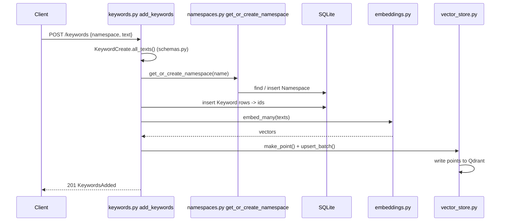
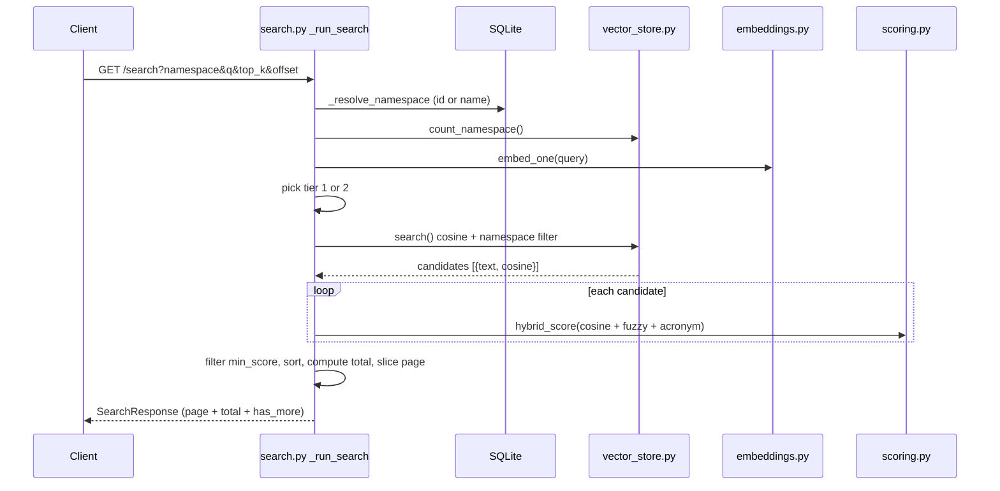

# Code Walkthrough

This document explains **how the code works**, following the real execution path in order:
first what happens at **startup**, then **storing a keyword**, then **searching** for it in a
namespace. Each step names the exact **file and function** where it happens.

For *what* the service does and how to run it, see [README.md](README.md). This doc is about the
*internals*.

---

## The files at a glance

Everything lives under `app/`. Each module has one job:

| File | Responsibility |
|------|----------------|
| `app/main.py` | App entry point: startup hooks, mounts routers, `/health`, `/admin/reindex` |
| `app/config.py` | All settings (env-driven): model, Qdrant URL, weights, tier limits |
| `app/db.py` | SQLite engine + session, table creation |
| `app/models.py` | Database tables: `Namespace`, `Keyword` (SQLModel) |
| `app/schemas.py` | Request/response shapes (Pydantic) — the API contract |
| `app/embeddings.py` | Turns text into vectors via `fastembed` |
| `app/vector_store.py` | All Qdrant operations (upsert, delete, count, cosine search) |
| `app/scoring.py` | The hybrid re-ranker: semantic + fuzzy + acronym |
| `app/routers/namespaces.py` | Namespace endpoints + `get_or_create_namespace` helper |
| `app/routers/keywords.py` | Keyword endpoints (add / list / get / update / delete) |
| `app/routers/search.py` | The search endpoint and its two-tier logic |

**Two stores, two roles** — worth internalizing before reading on:
- **SQLite** (`models.py` + `db.py`) is the **source of truth** for metadata: which namespaces
  and keywords exist. Used for listing, counting, and IDs.
- **Qdrant** (`vector_store.py`) holds the **vectors** — one point per keyword — and does the
  cosine similarity search. A Qdrant point's `id` equals the SQLite keyword's `id`, and its payload
  carries `{namespace_id, keyword_id, text}`.

---

## Part 0 — Startup (when the container boots)

Entry point: **`app/main.py`**.

1. **`lifespan()`** (`main.py:12`) runs once before serving traffic and does three things:
   - `init_db()` → **`db.py`**: creates the SQLite tables from `models.py` if they don't exist.
   - `vector_store.ensure_collection()` → **`vector_store.py:16`**: creates the Qdrant collection
     (cosine distance, `EMBED_DIM` dimensions) and a payload index on `namespace_id` so filtered
     search is fast.
   - `embeddings.warmup()` → **`embeddings.py`**: loads the embedding model and runs one throwaway
     encode, so the first real request isn't slow.
2. **Routers are mounted** (`main.py:28-30`): the namespace, keyword, and search routes are attached
   to the app.

After this, the service is ready.

---

## Part 1 — Storing a keyword

**Request:** `POST /keywords` with `{"namespace": "maincourse", "text": "Chicken Biriyani"}`
(or `"texts": [...]` for bulk). Handled entirely by **`app/routers/keywords.py`**, function
**`add_keywords()`** (`keywords.py:25`).

The steps, in order:

### 1. Validate & normalize the request
- The JSON body is parsed into **`KeywordCreate`** (`schemas.py`). Its validator requires that
  either `text` or `texts` is present.
- `add_keywords` calls **`body.all_texts()`** (`schemas.py`), which merges `text`/`texts`, trims
  blanks, and de-duplicates — returning a clean list of keyword strings (`keywords.py:32`).

### 2. Resolve (or create) the namespace — SQLite
- `add_keywords` calls **`get_or_create_namespace(session, body.namespace)`**
  (defined in **`namespaces.py:27`**, imported at `keywords.py:9`).
- That helper looks up the namespace **by name** in SQLite. If found, returns it; if not, inserts a
  new `Namespace` row and returns `(namespace, created=True)`. A unique-name constraint + an
  `IntegrityError` fallback make it safe under concurrent inserts.
- **This is why there's no separate "create namespace" endpoint** — namespaces come into existence
  here.

### 3. Insert the keyword rows — SQLite
- For each text, a **`Keyword`** model (`models.py`) is created with the namespace's id
  (`keywords.py:38`).
- `session.add_all(...)` + `session.commit()` writes them to SQLite; `session.refresh(kw)` populates
  each row's auto-generated `id` (`keywords.py:39-42`). SQLite is now the source of truth.

### 4. Turn the text into vectors — fastembed
- **`embeddings.embed_many([...])`** (`embeddings.py`) encodes every keyword string into a
  384-dim vector using the `all-MiniLM-L6-v2` model via ONNX (`keywords.py:44`).
- Embeddings are computed **once, here at write time** — so searches never have to embed stored data.

### 5. Write the vectors to Qdrant
- Each `(keyword_id, namespace_id, text, vector)` becomes a Qdrant point via
  **`vector_store.make_point(...)`** (`vector_store.py:62`), reusing the SQLite `id` as the point id
  (`keywords.py:45-48`).
- **`vector_store.upsert_batch(points)`** (`vector_store.py:55`) writes them all to Qdrant in one call
  (`keywords.py:49`).

### 6. Respond
- Returns a **`KeywordsAdded`** (`schemas.py`): the resolved `namespace`, its `namespace_id`,
  `namespace_created` (was it just created?), and the list of `created` keyword records
  (`keywords.py:51-56`).

**End state:** the keyword now exists in **both** stores — a metadata row in SQLite and a vector in
Qdrant, linked by the same id.

---

## Part 2 — Searching a keyword in a namespace

**Request:** `GET /search?namespace=maincourse&q=chkn+biriyani&top_k=5`. Handled by
**`app/routers/search.py`**.

### 1. Route entry
- **`search_get(...)`** (`search.py:106`) reads the query params and packs them into a
  **`SearchRequest`** (`schemas.py`), then calls **`_run_search(req, session)`** (`search.py:27`).
  (`POST /search`, `search.py:131`, does the same with a JSON body — both share `_run_search`.)

Everything below is inside **`_run_search`**.

### 2. Resolve the namespace — SQLite
- **`_resolve_namespace(session, req.namespace)`** (`search.py:15`) accepts an **id or a name**:
  tries an id lookup if the value is numeric, else looks up by name. 404s if not found
  (`search.py:29`).

### 3. Resolve effective parameters
- Page size `top_k`, `offset`, and the three blend weights (`w_semantic`, `w_fuzzy`, `w_acronym`)
  fall back to defaults from **`config.py`** when not supplied per-request (`search.py:31-35`).

### 4. Count the namespace & embed the query
- **`vector_store.count_namespace(ns.id)`** (`vector_store.py:90`) asks Qdrant for the exact number
  of keywords in this namespace (`search.py:37`).
- **`embeddings.embed_one(req.q)`** (`embeddings.py`) turns the query string into a vector — the only
  embedding done per search (`search.py:38`).

### 5. Pick a tier (scaling decision)
`search.py:46-54`:
- **Tier 1 (small namespace ≤ `EXACT_SCAN_LIMIT`)**: `pool_limit = namespace_size` — every keyword
  will be scored. Exact.
- **Tier 2 (large namespace)**: `pool_limit` is a bounded cosine candidate pool sized to cover the
  requested page (`(offset + top_k) × CANDIDATE_MULTIPLIER`, floored at `MIN_CANDIDATES`). Fast but
  approximate.

### 6. Fetch candidates by cosine — Qdrant
- **`vector_store.search(ns.id, query_vec, limit=pool_limit)`** (`vector_store.py:103`) runs a Qdrant
  cosine search **filtered to this namespace** (the `namespace_id` payload filter) and returns
  `[{keyword_id, text, score}]`, where `score` is the raw cosine similarity (`search.py:56`).

### 7. Re-rank with the hybrid scorer — scoring.py
For each candidate (`search.py:58-79`):
- **`scoring.hybrid_score(query, text, semantic, weights...)`** (`scoring.py`) blends three signals:
  - **semantic** — the cosine from Qdrant (meaning; catches `Chicken`, `biriyani`).
  - **fuzzy** — `rapidfuzz` WRatio / token_set_ratio on the text (catches the misspelling `chkn`).
  - **acronym** — a boost if the query equals the keyword's initials (catches `CB`).
- The final score is the weighted, normalized blend in `[0, 1]`.
- Candidates below `min_score` are dropped; the rest become **`SearchHit`** objects (`schemas.py`)
  carrying the total plus each sub-score for transparency.

### 8. Sort, compute totals, paginate
- Sort by `score` descending (`search.py:81`).
- **Total logic** (`search.py:83-90`):
  - Tier 1 → `total = len(scored)`, `total_is_exact = True`.
  - Tier 2 with `min_score = 0` → every keyword matches, so `total = namespace_size` exactly (cheap).
  - Tier 2 with `min_score > 0` → `total` is the pool count, `total_is_exact = False` (approximate).
- **Paginate**: slice `scored[offset : offset + top_k]` for the page (`search.py:92`).

### 9. Respond
- Returns a **`SearchResponse`** (`schemas.py`): `count`, `total`, `total_is_exact`, `offset`,
  `limit`, `has_more`, and the `results` page (`search.py:93-103`).

---

## Cross-cutting concerns — where each lives

- **Configuration** — `config.py` (`Settings` / `get_settings()`); values come from env / `.env`.
- **Database session** — `db.py` (`get_session` is the FastAPI dependency injected into every route).
- **API contract** — `schemas.py` (all request/response models). Change the shape here.
- **Embedding model** — `embeddings.py` (swap the model via `EMBED_MODEL`/`EMBED_DIM`).
- **Vector operations** — `vector_store.py` (the only file that talks to Qdrant).
- **Ranking logic** — `scoring.py` (tune how misspellings/abbreviations/meaning are weighted).

## Related operations (same building blocks)

- **List keywords** — `keywords.py:59` `list_keywords`: reads straight from SQLite (no Qdrant).
- **Update a keyword** — `keywords.py:87` `update_keyword`: updates SQLite, then **re-embeds** and
  re-upserts the single vector (`embeddings.embed_one` → `vector_store.upsert_keyword`).
- **Delete a keyword** — `keywords.py:103`: deletes from SQLite **and** Qdrant.
- **Delete a namespace** — `namespaces.py` `delete_namespace`: cascades keyword rows in SQLite and
  calls `vector_store.delete_by_namespace` to drop all its vectors.
- **Reindex** — `main.py:39` `/admin/reindex`: rebuilds every Qdrant vector from the SQLite rows,
  the recovery path if the two stores ever drift.
