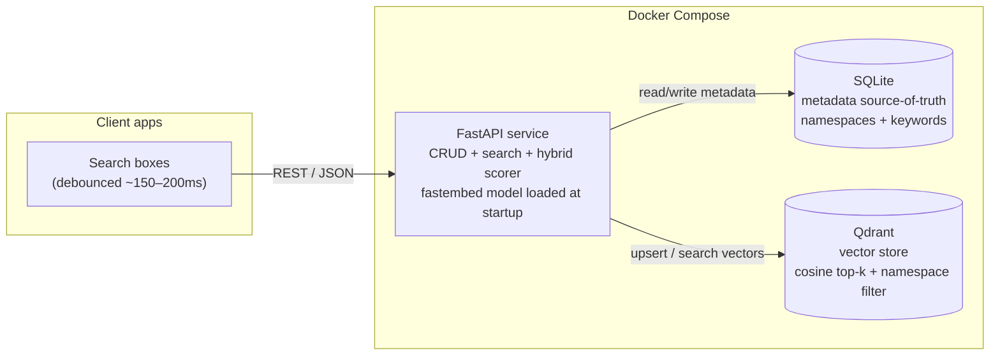
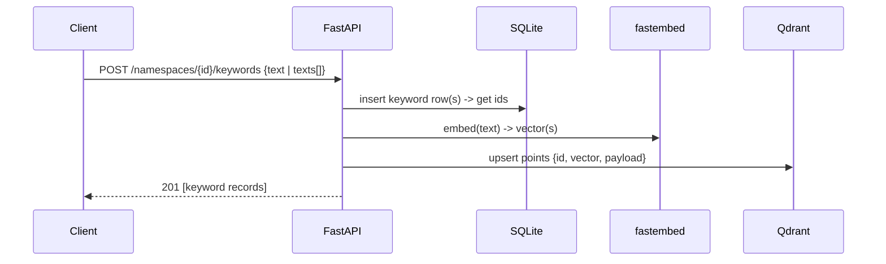
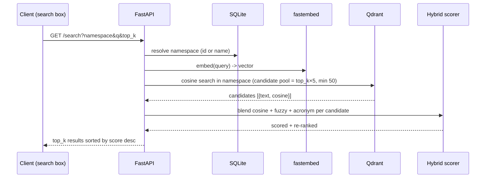
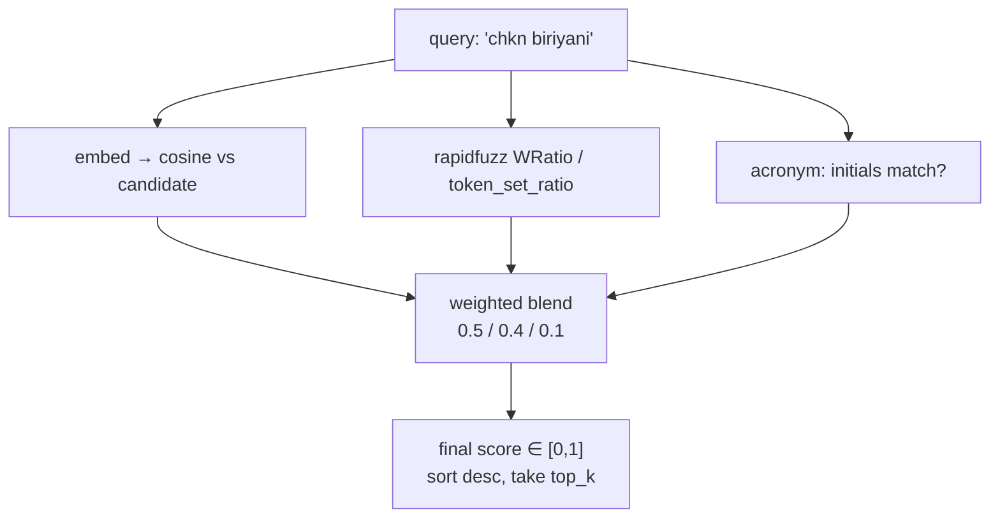

# Similarity Search Engine

A small, Dockerized REST service for **namespaced keyword similarity search**. Create
namespaces (groups), add keywords to them, and search a namespace for a query keyword. Search
tolerates **misspellings**, **abbreviations**, and **semantic / partial** matches — built to power
**search-as-you-type** across many search boxes.

> **Example:** with `Chicken Biriyani` stored in namespace `maincourse`, searching any of
> `chkn biriyani`, `CB`, `Chicken`, or `biriyani` returns **Chicken Biriyani**.

---

## Table of contents
- [Why this design](#why-this-design)
- [How it works](#how-it-works)
  - [Architecture](#architecture)
  - [Adding a keyword (write path)](#adding-a-keyword-write-path)
  - [Searching (read path)](#searching-read-path)
  - [How a query is scored](#how-a-query-is-scored)
- [Quick start](#quick-start)
- [API reference](#api-reference)
- [Using it in search boxes](#using-it-in-search-boxes)
- [Configuration](#configuration)
- [Development & tests](#development--tests)
- [Project layout](#project-layout)

---

## Why this design

Pure word-embedding cosine similarity handles **meaning** (`Chicken`, `biriyani`) but does **not**
reliably handle **misspellings** (`chkn`) or **abbreviations** (`CB`) — those are character/token
level problems, not semantic ones. So each search blends three signals into one score:

| Signal      | Catches                          | Implementation                              |
|-------------|----------------------------------|---------------------------------------------|
| **Semantic**| `Chicken`, `biriyani` (meaning)  | `fastembed` embeddings + Qdrant cosine top-k|
| **Fuzzy**   | `chkn biriyani` (typo/partial)   | `rapidfuzz` WRatio / token_set_ratio        |
| **Acronym** | `CB` (abbreviation)              | initials match                              |

```
score = (w_semantic·semantic + w_fuzzy·fuzzy + w_acronym·acronym) / (w_semantic + w_fuzzy + w_acronym)
```

Weights default to `0.5 / 0.4 / 0.1` and are configurable globally (env) or **per request**.

---

## How it works

### Architecture



- **FastAPI** (`app/`) exposes CRUD + search and runs the hybrid re-ranker. The embedding model
  is loaded once at startup.
- **SQLite** is the **source of truth** for namespace/keyword metadata (supports listing,
  pagination, and namespaces that exist with zero keywords).
- **Qdrant** stores one vector per keyword — `point.id = keyword.id`, payload
  `{namespace_id, keyword_id, text}` — and does cosine top-k filtered by `namespace_id`.

Writes go to **SQLite first, then Qdrant**; deletes cascade to both. `POST /admin/reindex`
rebuilds Qdrant from SQLite if the two ever drift.

### Adding a keyword (write path)



Embeddings are computed **once at insert time**, so searches never have to embed stored data.

### Searching (read path)



The service pulls a **wider candidate pool** from Qdrant than requested, so fuzzy/acronym scoring
can promote items the pure vector search ranked lower (e.g. a heavy misspelling like `chkn`).

### How a query is scored



Real output for the four example queries against `maincourse` (`Chicken Biriyani` seeded):

| Query           | Top result       | Score | Dominant signal |
|-----------------|------------------|-------|-----------------|
| `chkn biriyani` | Chicken Biriyani | 0.690 | fuzzy (0.90)    |
| `CB`            | Chicken Biriyani | 0.375 | acronym         |
| `Chicken`       | Chicken Biriyani | 0.716 | semantic+fuzzy  |
| `biriyani`      | Chicken Biriyani | 0.780 | semantic (0.78) |

---

## Quick start

**Prerequisites:** Docker + Docker Compose.

```bash
cp .env.example .env          # optional — compose has sane defaults
docker compose up --build
```

| Service | URL                        |
|---------|----------------------------|
| API     | http://localhost:8000      |
| Docs    | http://localhost:8000/docs |
| Qdrant  | http://localhost:6333      |

Check health:

```bash
curl http://localhost:8000/health          # {"status":"ok","qdrant":true}
```

Seed the demo namespace and run the example queries:

```bash
pip install httpx        # only needed to run the seed script from the host
python scripts/seed_demo.py
```

Or do it by hand:

```bash
# create a namespace
curl -X POST http://localhost:8000/namespaces \
  -H "Content-Type: application/json" \
  -d '{"name":"maincourse","description":"Main course dishes"}'

# add keywords (bulk)
curl -X POST http://localhost:8000/namespaces/1/keywords \
  -H "Content-Type: application/json" \
  -d '{"texts":["Chicken Biriyani","Paneer Butter Masala","Fish Curry"]}'

# search (typo tolerant)
curl "http://localhost:8000/search?namespace=maincourse&q=chkn%20biriyani&top_k=3"
```

Stop it with `docker compose down` (add `-v` to also wipe the data volumes).

---

## API reference

### Namespaces
| Method | Path                 | Body / notes                          |
|--------|----------------------|---------------------------------------|
| POST   | `/namespaces`        | `{"name": "...", "description": "?"}`  |
| GET    | `/namespaces`        | `?limit=&offset=` — includes `keyword_count` |
| GET    | `/namespaces/{id}`   |                                       |
| PUT    | `/namespaces/{id}`   | `{"name": "?", "description": "?"}`    |
| DELETE | `/namespaces/{id}`   | cascades to keywords (SQLite + Qdrant)|

### Keywords
| Method | Path                          | Body / notes                                   |
|--------|-------------------------------|------------------------------------------------|
| POST   | `/namespaces/{id}/keywords`   | `{"text": "..."}` or `{"texts": ["...", ...]}` |
| GET    | `/namespaces/{id}/keywords`   | `?limit=&offset=`                              |
| GET    | `/keywords/{id}`              |                                                |
| PUT    | `/keywords/{id}`             | `{"text": "..."}` — re-embeds                  |
| DELETE | `/keywords/{id}`             |                                                |

### Search
`GET /search?namespace={id|name}&q={query}&top_k=10&min_score=0`
(optional per-request weights `w_semantic`, `w_fuzzy`, `w_acronym`).
`POST /search` accepts the same fields as a JSON body.

Response:

```json
{
  "namespace": "maincourse",
  "query": "chkn biriyani",
  "count": 1,
  "results": [
    {
      "keyword_id": 1,
      "text": "Chicken Biriyani",
      "score": 0.690,
      "semantic_score": 0.664,
      "fuzzy_score": 0.897,
      "acronym_match": false
    }
  ]
}
```

### Ops
| Method | Path              | Purpose                              |
|--------|-------------------|--------------------------------------|
| GET    | `/health`         | liveness (Qdrant reachable)          |
| POST   | `/admin/reindex`  | rebuild all vectors from SQLite      |

Interactive OpenAPI docs are served at `/docs`.

---

## Using it in search boxes

Call `GET /search` from each box, **debounced ~150–200 ms**, so a query fires only after a typing
pause instead of on every keystroke. Because keyword embeddings are precomputed at insert time,
each search only has to embed the short query string plus do a top-k lookup — typically a few
milliseconds on CPU.

```js
let t;
input.addEventListener("input", (e) => {
  clearTimeout(t);
  const q = e.target.value.trim();
  if (!q) return;
  t = setTimeout(async () => {
    const url = `http://localhost:8000/search?namespace=maincourse&q=${encodeURIComponent(q)}&top_k=8`;
    const { results } = await fetch(url).then((r) => r.json());
    render(results); // [{keyword_id, text, score, ...}]
  }, 180);
});
```

---

## Configuration

All settings come from environment variables (see `.env.example`):

| Variable                        | Default                                     | Purpose                          |
|---------------------------------|---------------------------------------------|----------------------------------|
| `QDRANT_URL`                    | `http://qdrant:6333`                        | Qdrant endpoint                  |
| `QDRANT_COLLECTION`             | `keywords`                                  | Qdrant collection name           |
| `EMBED_MODEL`                   | `sentence-transformers/all-MiniLM-L6-v2`    | any fastembed model              |
| `EMBED_DIM`                     | `384`                                       | must match the model's dimension |
| `DATABASE_URL`                  | `sqlite:////data/simsearch.db`              | metadata store                   |
| `DEFAULT_TOP_K`                 | `10`                                        | default result count             |
| `W_SEMANTIC` / `W_FUZZY` / `W_ACRONYM` | `0.5` / `0.4` / `0.1`                | hybrid score weights             |

To swap the embedding model, change `EMBED_MODEL` **and** `EMBED_DIM` together and rebuild.

---

## Development & tests

```bash
python -m venv .venv && ./.venv/Scripts/activate    # Windows; use source .venv/bin/activate on *nix
pip install -r requirements.txt
pytest
```

The test suite (`tests/`) runs **without Docker** — it uses an **in-memory Qdrant** and a temp
SQLite DB. It covers namespace/keyword CRUD, re-embed on update, the four example query cases,
`top_k` limiting/sorting, namespace isolation, and the scoring functions.

---

## Project layout

```
SimSearchEngine/
├── docker-compose.yml          # qdrant + api services
├── Dockerfile                  # pre-downloads the embedding model into the image
├── requirements.txt
├── .env.example
├── scripts/seed_demo.py        # seeds 'maincourse' and runs the biriyani queries
├── app/
│   ├── main.py                 # app factory, startup, /health, /admin/reindex
│   ├── config.py               # env-driven settings
│   ├── db.py                   # SQLModel engine/session
│   ├── models.py               # Namespace, Keyword tables
│   ├── schemas.py              # request/response models
│   ├── embeddings.py           # fastembed load + encode
│   ├── vector_store.py         # Qdrant wrapper (upsert/delete/search)
│   ├── scoring.py              # hybrid re-ranker (cosine + fuzzy + acronym)
│   └── routers/                # namespaces.py, keywords.py, search.py
└── tests/                      # pytest suite (no Docker needed)
```
